# inferlab サービス構成図

この図は `docker-compose.yml` が include する標準 Compose ファイルを profile 単位で整理したものです。各サービスには Mermaid Architecture Beta の Iconify 形式で、VS Code 標準 Markdown プレビューでも表示できる `logos` または `mdi` のアイコンを割り当てています。

```mermaid
%%{init: {"theme": "base", "architecture": {"nodeSeparation": 90, "idealEdgeLengthMultiplier": 2.2, "edgeElasticity": 0.3, "numIter": 3500, "seed": 7}, "themeVariables": {"archEdgeColor": "#374151", "archEdgeArrowColor": "#111827", "archGroupBorderColor": "#6b7280", "archGroupTextColor": "#111827"}}}%%
architecture-beta
    group access(mdi:web)[Access]
    service users(mdi:account-group)[Users] in access
    service internet(mdi:web)[Internet] in access
    service public_host(mdi:monitor)[PUBLIC_HOST ports] in access

    group common(mdi:home)[00 common]
    service homepage(mdi:home)[Homepage] in common
    service keycloak(mdi:shield-key)[Keycloak] in common
    service keycloak_https(mdi:shield-key)[Keycloak HTTPS] in common
    service keycloak_postgres(logos:postgresql)[Keycloak PostgreSQL] in common

    group infra(logos:cloudflare)[01 infra]
    service cloudflare(logos:cloudflare)[Cloudflared] in infra
    service couchdb(logos:couchdb)[CouchDB] in infra

    group inference(mdi:robot)[10 inference]
    service litellm(mdi:api)[LiteLLM] in inference
    service ollama(mdi:robot)[Ollama] in inference
    service ollama_init(mdi:robot)[Ollama Init] in inference
    service tei_embedding(logos:hugging-face)[TEI Embedding] in inference
    service tei_reranking(logos:hugging-face)[TEI Reranking] in inference
    service hermes_agent(logos:hermes)[Hermes Agent] in inference
    service openrouter(logos:openai-icon)[OpenRouter and Gemini] in inference
    service discord(mdi:message-text)[Discord] in inference

    group webui(mdi:monitor-dashboard)[11 webui]
    service open_webui(mdi:robot)[Open WebUI] in webui
    service open_terminal(logos:terminal)[Open Terminal] in webui
    service docling(mdi:file-document)[Docling] in webui
    service searxng(mdi:magnify-scan)[SearXNG] in webui
    service voicevox_engine(mdi:account-voice)[VOICEVOX Engine] in webui
    service voicevox_api(mdi:microphone-message)[VOICEVOX API] in webui
    service qdrant(logos:qdrant)[Qdrant] in webui

    group storage(mdi:cloud)[12 storage]
    service nextcloud(mdi:cloud)[Nextcloud] in storage
    service nextcloud_mariadb(logos:mariadb)[Nextcloud MariaDB] in storage
    service nextcloud_redis(logos:redis)[Nextcloud Redis] in storage
    service oikb(mdi:book-open-page-variant)[OIKB] in storage

    group automation(mdi:sitemap)[13 automation]
    service dify_nginx(logos:nginx)[Dify Nginx] in automation
    service dify_web(mdi:sitemap)[Dify Web] in automation
    service dify_api(mdi:api)[Dify API] in automation
    service dify_worker(mdi:cog)[Dify Worker] in automation
    service dify_worker_beat(mdi:cog-clockwise)[Dify Worker Beat] in automation
    service dify_plugin_daemon(mdi:puzzle)[Dify Plugin Daemon] in automation
    service dify_agent_backend(mdi:robot)[Dify Agent Backend] in automation
    service dify_sandbox(mdi:code-braces)[Dify Sandbox] in automation
    service dify_local_sandbox(mdi:file-code)[Dify Local Sandbox] in automation
    service dify_ssrf_proxy(mdi:shield-check)[Dify SSRF Proxy] in automation
    service dify_init_permissions(mdi:shield-check)[Dify Init Permissions] in automation
    service dify_postgres(logos:postgresql)[Dify PostgreSQL] in automation
    service dify_redis(logos:redis)[Dify Redis] in automation
    service dify_qdrant(logos:qdrant)[Dify Qdrant] in automation

    group team_chat(logos:zulip)[20 team chat]
    service zulip(logos:zulip)[Zulip] in team_chat
    service zulip_postgres(logos:postgresql)[Zulip PostgreSQL] in team_chat
    service zulip_memcached(logos:memcached)[Zulip Memcached] in team_chat
    service zulip_rabbitmq(logos:rabbitmq)[Zulip RabbitMQ] in team_chat
    service zulip_redis(logos:redis)[Zulip Redis] in team_chat

    group team_project(mdi:chart-timeline-variant)[21 team project]
    service leantime(mdi:chart-timeline-variant)[Leantime] in team_project
    service leantime_db(logos:mysql)[Leantime MySQL] in team_project

    group team_wiki(mdi:book-open-page-variant)[22 team wiki]
    service bookstack(mdi:book-open-page-variant)[BookStack] in team_wiki
    service bookstack_mariadb(logos:mariadb)[BookStack MariaDB] in team_wiki

    group team_git(mdi:git)[23 team git]
    service gitea(mdi:git)[Gitea] in team_git
    service gitea_postgres(logos:postgresql)[Gitea PostgreSQL] in team_git

    group developer(mdi:microsoft-visual-studio-code)[30 developer]
    service pypiserver(logos:pypi)[PyPI Server] in developer
    service verdaccio(logos:verdaccio)[Verdaccio] in developer
    service code_marketplace(mdi:microsoft-visual-studio-code)[Code Marketplace] in developer
    service code_marketplace_publisher(mdi:microsoft-visual-studio-code)[Marketplace Publisher] in developer
    service repo_landing_page(mdi:web)[Repo Landing Page] in developer
    service rpm_repo(logos:redhat)[RPM Repo] in developer
    service deb_repo(logos:debian)[APT Repo] in developer
    service asset_publisher(mdi:package-variant-closed)[Asset Publisher] in developer
    service npm_publisher(logos:nodejs-icon)[npm Publisher] in developer
    service rpm_publisher(logos:redhat)[RPM Publisher] in developer
    service aptly_publisher(logos:debian)[Aptly Publisher] in developer

    group o11y(logos:grafana)[50 o11y]
    service grafana(logos:grafana)[Grafana] in o11y
    service prometheus(logos:prometheus)[Prometheus] in o11y
    service node_exporter(mdi:server)[Node Exporter] in o11y
    service cadvisor(logos:docker)[cAdvisor] in o11y
    service blackbox_exporter(mdi:magnify-scan)[Blackbox Exporter] in o11y

    group llmops(mdi:chart-line)[51 llmops]
    service langfuse_web(mdi:chart-line)[Langfuse Web] in llmops
    service langfuse_worker(mdi:cog)[Langfuse Worker] in llmops
    service langfuse_clickhouse(mdi:chart-histogram)[Langfuse ClickHouse] in llmops
    service langfuse_minio(mdi:harddisk)[Langfuse MinIO] in llmops
    service langfuse_redis(logos:redis)[Langfuse Redis] in llmops
    service langfuse_postgres(logos:postgresql)[Langfuse PostgreSQL] in llmops

    users:R --> L:internet
    internet:R --> L:public_host
    internet:B --> T:cloudflare
    cloudflare:R --> L:public_host
    public_host:R --> L:homepage
    public_host:R --> L:open_webui
    public_host:R --> L:nextcloud
    public_host:R --> L:dify_nginx
    public_host:R --> L:grafana

    keycloak:R --> L:keycloak_postgres
    keycloak_https:R --> L:keycloak_postgres
    keycloak_https:B --> T:keycloak
    open_webui:T --> B:keycloak
    nextcloud:T --> B:keycloak
    grafana:T --> B:keycloak
    langfuse_web:T --> B:keycloak
    leantime:T --> B:keycloak
    bookstack:T --> B:keycloak
    zulip:T --> B:keycloak_https

    litellm:R --> L:ollama
    litellm:R --> L:tei_embedding
    litellm:R --> L:tei_reranking
    litellm:T --> B:openrouter
    ollama:R --> L:ollama_init
    hermes_agent:R --> L:open_webui
    hermes_agent:R --> L:litellm
    hermes_agent:R --> L:searxng
    hermes_agent:R --> L:docling
    hermes_agent:R --> L:langfuse_web
    hermes_agent:T --> B:discord

    open_webui:R --> L:litellm
    open_webui:R --> L:hermes_agent
    open_webui:R --> L:open_terminal
    open_webui:R --> L:docling
    open_webui:R --> L:searxng
    open_webui:R --> L:voicevox_api
    open_webui:R --> L:qdrant
    voicevox_api:R --> L:voicevox_engine

    nextcloud:R --> L:nextcloud_mariadb
    nextcloud:R --> L:nextcloud_redis
    oikb:R --> L:nextcloud
    oikb:T --> B:open_webui

    dify_nginx:R --> L:dify_web
    dify_nginx:R --> L:dify_api
    dify_nginx:R --> L:dify_plugin_daemon
    dify_web:R --> L:dify_api
    dify_api:R --> L:dify_postgres
    dify_api:R --> L:dify_redis
    dify_api:R --> L:dify_qdrant
    dify_api:R --> L:dify_sandbox
    dify_api:R --> L:dify_plugin_daemon
    dify_api:R --> L:dify_agent_backend
    dify_worker:R --> L:dify_postgres
    dify_worker:R --> L:dify_redis
    dify_worker:R --> L:dify_qdrant
    dify_worker_beat:R --> L:dify_redis
    dify_plugin_daemon:R --> L:dify_postgres
    dify_plugin_daemon:R --> L:dify_redis
    dify_agent_backend:R --> L:dify_plugin_daemon
    dify_agent_backend:R --> L:dify_local_sandbox
    dify_sandbox:R --> L:dify_ssrf_proxy
    dify_init_permissions:R --> L:dify_api

    zulip:R --> L:zulip_postgres
    zulip:R --> L:zulip_memcached
    zulip:R --> L:zulip_rabbitmq
    zulip:R --> L:zulip_redis
    leantime:R --> L:leantime_db
    bookstack:R --> L:bookstack_mariadb
    gitea:R --> L:gitea_postgres

    code_marketplace_publisher:R --> L:code_marketplace
    repo_landing_page:R --> L:rpm_repo
    repo_landing_page:R --> L:deb_repo
    asset_publisher:R --> L:pypiserver
    npm_publisher:R --> L:verdaccio
    rpm_publisher:R --> L:rpm_repo
    aptly_publisher:R --> L:deb_repo

    grafana:R --> L:prometheus
    prometheus:R --> L:node_exporter
    prometheus:R --> L:cadvisor
    prometheus:R --> L:blackbox_exporter
    prometheus:T --> B:litellm
    prometheus:T --> B:open_webui
    prometheus:T --> B:qdrant
    prometheus:T --> B:keycloak
    prometheus:T --> B:gitea
    prometheus:T --> B:langfuse_clickhouse
    prometheus:T --> B:langfuse_minio

    langfuse_web:R --> L:langfuse_postgres
    langfuse_web:R --> L:langfuse_minio
    langfuse_web:R --> L:langfuse_redis
    langfuse_web:R --> L:langfuse_clickhouse
    langfuse_worker:R --> L:langfuse_postgres
    langfuse_worker:R --> L:langfuse_minio
    langfuse_worker:R --> L:langfuse_redis
    langfuse_worker:R --> L:langfuse_clickhouse
    litellm:T --> B:langfuse_web
```

## References

- [Mermaid Architecture Diagrams Documentation](https://mermaid.ai/open-source/syntax/architecture.html)
- [Mermaid Registering icon pack](https://mermaid.ai/open-source/config/icons.html)
- [Iconify Logos icon set](https://icon-sets.iconify.design/logos/)
- [Iconify Material Design Icons icon set](https://icon-sets.iconify.design/mdi/)
