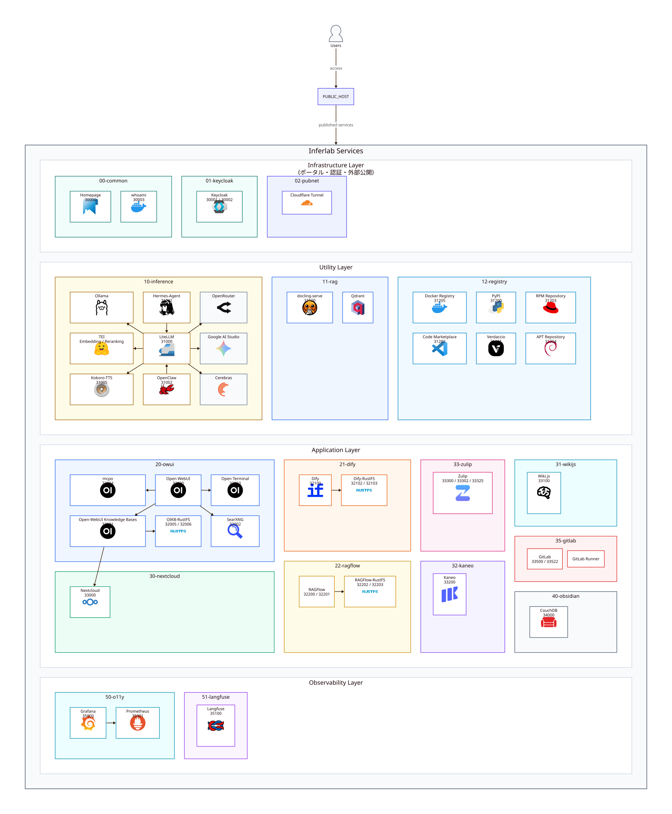

# ローカル実行環境

複数の機能を Docker Compose profile で分けて起動するための構成です。



## 起動手順

通常はラッパースクリプトで標準 profile を順番に起動します。

```bash
# 標準 profile を順番に起動する。
sudo ./dc.sh up --remove-orphans
```

期待結果:

- 標準 profile のコンテナが起動する。
- 主要コンテナが `running` または `healthy` になる。

失敗条件:

- Compose 設定の解決に失敗する。
- 必須コンテナが `unhealthy` になる。

初回設定は [docs/INITIAL_SETUP.md](docs/INITIAL_SETUP.md) を参照してください。

## 一括起動

すべての標準 profile を 1 回の Compose 実行にまとめる場合は、次のコマンドを使います。

```bash
# 標準 profile を 1 つの Compose 実行で起動する。
sudo ./dc.sh up-full --remove-orphans
```

期待結果:

- 標準 profile のコンテナがまとめて起動する。
- 主要コンテナが `running` または `healthy` になる。

失敗条件:

- Compose 設定の解決に失敗する。
- コンテナ間の依存関係を満たせない。

## Profile

`dc.sh up` の標準起動に含まれる profile は `common`、`keycloak`、`pubnet`、`inference`、`rag`、`registry`、`owui`、`nextcloud`、`o11y`、`llmops` です。その他の profile は必要な場合に個別に指定します。

| Profile | Compose file | 用途 |
| --- | --- | --- |
| `common` | `00-common/docker-compose.yml` | 共通入口と疎通確認 |
| `keycloak` | `01-keycloak/docker-compose.yml` | 認証 |
| `pubnet` | `02-pubnet/docker-compose.yml` | 外部公開ネットワーク |
| `inference` | `10-inference/docker-compose.yml` | 推論、埋め込み、エージェント、音声合成 |
| `rag` | `11-rag/docker-compose.yml` | 文書処理とベクトル検索 |
| `registry` | `12-registry/docker-compose.yml` | 開発用パッケージ配布 |
| `owui` | `20-owui/docker-compose.yml` | Open WebUI、検索、ツール連携、Knowledge同期 |
| `dify` | `21-dify/docker-compose.yml` | 自動化 |
| `nextcloud` | `30-nextcloud/docker-compose.yml` | ファイル保存 |
| `bookstack` | `31-bookstack/docker-compose.yml` | Wiki |
| `kaneo` | `32-kaneo/docker-compose.yml` | プロジェクト管理 |
| `zulip` | `33-zulip/docker-compose.yml` | チャット |
| `gitea` | `34-gitea/docker-compose.yml` | Git 管理 |
| `leantime` | `39-leantime/docker-compose.yml` | プロジェクト管理 |
| `obsidian` | `40-obsidian/docker-compose.yml` | Obsidian同期用CouchDB |
| `o11y` | `50-o11y/docker-compose.yml` | 監視 |
| `llmops` | `51-llmops/docker-compose.yml` | LLM 観測 |

### Service 一覧

ルートの `docker-compose.yml` が include する Compose ファイルに定義された有効な service は次のとおりです。`Port` が `-` の service は host へ公開していません。

| Profile | Service | Port | Compose file |
| --- | --- | --- | --- |
| `common` | `homepage` | `30000` | `00-common/docker-compose.yml` |
| `common` | `whoami` | `${WHOAMI_HTTP_HOST_PORT:-30003}` | `00-common/docker-compose.yml` |
| `keycloak` | `keycloak` | `30001` | `01-keycloak/docker-compose.yml` |
| `keycloak` | `keycloak-https` | `${KEYCLOAK_HTTPS_HOST_PORT:-30002}` | `01-keycloak/docker-compose.yml` |
| `keycloak` | `keycloak-postgres` | - | `01-keycloak/docker-compose.yml` |
| `pubnet` | `cloudflare` | - | `02-pubnet/docker-compose.yml` |
| `inference` | `litellm` | `31000` | `10-inference/docker-compose.yml` |
| `inference` | `ollama` | - | `10-inference/docker-compose.yml` |
| `inference` | `ollama-init` | - | `10-inference/docker-compose.yml` |
| `inference` | `tei-embedding` | - | `10-inference/docker-compose.yml` |
| `inference` | `tei-reranking` | - | `10-inference/docker-compose.yml` |
| `inference`, `hermes-agent` | `hermes-agent` | `31001` | `10-inference/docker-compose.yml` |
| `inference`, `hermes-agent` | `openclaw` | `31002` | `10-inference/docker-compose.yml` |
| `inference` | `kokoro` | `31005` | `10-inference/docker-compose.yml` |
| `rag` | `docling` | `31100` | `11-rag/docker-compose.yml` |
| `rag` | `qdrant` | - | `11-rag/docker-compose.yml` |
| `registry` | `pypiserver` | `${PYPISERVER_HTTP_HOST_PORT:-31200}` | `12-registry/docker-compose.yml` |
| `registry` | `verdaccio` | `${VERDACCIO_HTTP_HOST_PORT:-31201}` | `12-registry/docker-compose.yml` |
| `registry` | `code-marketplace` | `${CODE_MARKETPLACE_HTTP_HOST_PORT:-31202}` | `12-registry/docker-compose.yml` |
| `registry` | `code-marketplace-importer` | - | `12-registry/docker-compose.yml` |
| `registry` | `npm-importer` | - | `12-registry/docker-compose.yml` |
| `registry` | `createrepo_c` | - | `12-registry/docker-compose.yml` |
| `registry` | `rpm-dist` | `${RPM_REPO_HTTP_HOST_PORT:-31203}` | `12-registry/docker-compose.yml` |
| `registry` | `reprepro` | - | `12-registry/docker-compose.yml` |
| `registry` | `deb-dist` | `${DEB_REPO_HTTP_HOST_PORT:-31204}` | `12-registry/docker-compose.yml` |
| `registry` | `docker-registry` | `${DOCKER_REGISTRY_HTTP_HOST_PORT:-31205}` | `12-registry/docker-compose.yml` |
| `owui` | `open-webui` | `32000` | `20-owui/docker-compose.yml` |
| `owui` | `open-terminal` | `32003` | `20-owui/docker-compose.yml` |
| `owui` | `mcpo` | `32004` | `20-owui/docker-compose.yml` |
| `owui` | `searxng` | `32002` | `20-owui/docker-compose.yml` |
| `owui` | `oikb-rustfs` | `32005`, `32006` | `20-owui/docker-compose.yml` |
| `owui` | `oikb-rustfs-bucket-init` | - | `20-owui/docker-compose.yml` |
| `owui` | `oikb` | `32001` | `20-owui/docker-compose.yml` |
| `dify` | `dify-init-permissions` | - | `21-dify/docker-compose.yml` |
| `dify` | `dify-api` | - | `21-dify/docker-compose.yml` |
| `dify` | `dify-worker` | - | `21-dify/docker-compose.yml` |
| `dify` | `dify-worker-beat` | - | `21-dify/docker-compose.yml` |
| `dify` | `dify-web` | - | `21-dify/docker-compose.yml` |
| `dify` | `dify-plugin-daemon` | - | `21-dify/docker-compose.yml` |
| `dify` | `dify-sandbox` | - | `21-dify/docker-compose.yml` |
| `dify` | `dify-local-sandbox` | - | `21-dify/docker-compose.yml` |
| `dify` | `dify-agent-backend` | - | `21-dify/docker-compose.yml` |
| `dify` | `dify-ssrf-proxy` | - | `21-dify/docker-compose.yml` |
| `dify` | `dify-postgres` | - | `21-dify/docker-compose.yml` |
| `dify` | `dify-redis` | - | `21-dify/docker-compose.yml` |
| `dify` | `dify-qdrant` | - | `21-dify/docker-compose.yml` |
| `dify` | `dify-nginx` | `32100` | `21-dify/docker-compose.yml` |
| `nextcloud` | `nextcloud` | `33000` | `30-nextcloud/docker-compose.yml` |
| `nextcloud` | `nextcloud-postgres` | - | `30-nextcloud/docker-compose.yml` |
| `nextcloud` | `nextcloud-valkey` | - | `30-nextcloud/docker-compose.yml` |
| `bookstack` | `bookstack` | `${BOOKSTACK_HOST_PORT:-33100}` | `31-bookstack/docker-compose.yml` |
| `bookstack` | `bookstack-mariadb` | - | `31-bookstack/docker-compose.yml` |
| `kaneo` | `kaneo` | `33200` | `32-kaneo/docker-compose.yml` |
| `kaneo` | `kaneo-postgres` | - | `32-kaneo/docker-compose.yml` |
| `zulip` | `zulip` | `${ZULIP_HTTP_HOST_PORT:-33302}`, `${ZULIP_HTTPS_HOST_PORT:-33300}`, `${ZULIP_SMTP_HOST_PORT:-33325}` | `33-zulip/docker-compose.yml` |
| `zulip` | `zulip-postgres` | - | `33-zulip/docker-compose.yml` |
| `zulip` | `zulip-memcached` | - | `33-zulip/docker-compose.yml` |
| `zulip` | `zulip-rabbitmq` | - | `33-zulip/docker-compose.yml` |
| `zulip` | `zulip-redis` | - | `33-zulip/docker-compose.yml` |
| `gitea` | `gitea` | `${GITEA_HTTP_HOST_PORT:-33400}`, `${GITEA_SSH_HOST_PORT:-33422}` | `34-gitea/docker-compose.yml` |
| `gitea` | `gitea-postgres` | - | `34-gitea/docker-compose.yml` |
| `leantime` | `leantime` | `33900` | `39-leantime/docker-compose.yml` |
| `leantime` | `leantime-db` | - | `39-leantime/docker-compose.yml` |
| `obsidian` | `couchdb` | `34000` | `40-obsidian/docker-compose.yml` |
| `o11y` | `grafana` | `${GRAFANA_HTTP_HOST_PORT:-35000}` | `50-o11y/docker-compose.yml` |
| `o11y` | `prometheus` | `${PROMETHEUS_HTTP_HOST_PORT:-35001}` | `50-o11y/docker-compose.yml` |
| `o11y` | `llm-quota-exporter` | `${LLM_QUOTA_EXPORTER_HTTP_HOST_PORT:-35002}` | `50-o11y/docker-compose.yml` |
| `o11y` | `node-exporter` | - | `50-o11y/docker-compose.yml` |
| `o11y` | `cadvisor` | - | `50-o11y/docker-compose.yml` |
| `o11y` | `blackbox-exporter` | - | `50-o11y/docker-compose.yml` |
| `llmops` | `langfuse-worker` | - | `51-llmops/docker-compose.yml` |
| `llmops` | `langfuse-web` | `35100` | `51-llmops/docker-compose.yml` |
| `llmops` | `langfuse-clickhouse` | - | `51-llmops/docker-compose.yml` |
| `llmops` | `langfuse-valkey` | - | `51-llmops/docker-compose.yml` |
| `llmops` | `langfuse-rustfs` | `35102`, `35103` | `51-llmops/docker-compose.yml` |
| `llmops` | `langfuse-rustfs-bucket-init` | - | `51-llmops/docker-compose.yml` |
| `llmops` | `langfuse-postgres` | - | `51-llmops/docker-compose.yml` |

GPU 監視用 profile は任意です。対応するホストで、監視用 Compose と設定ファイルの該当コメントを解除して使います。

## 個別起動

監視 profile だけを起動する例です。

```bash
# 監視 profile だけを起動する。
sudo docker compose --env-file .env --profile o11y up -d
```

期待結果:

- 監視用 Web UI が指定ポートで応答する。
- メトリクス収集用のエンドポイントが応答する。

失敗条件:

- 監視用コンテナが `unhealthy` になる。
- 設定ファイルを読み込めない。

## オフライン用イメージ保存

現在の Compose 構成で使うイメージを保存する場合は、次のコマンドを使います。

```powershell
# 現在の Compose 構成で使うイメージを保存する。
pwsh -NoProfile -File script/download-stack-images.ps1
```

期待結果:

- `images/` に対象イメージごとの `.tar` が作成される。

失敗条件:

- 必要な取得コマンドが見つからない。
- いずれかのイメージ取得に失敗する。
