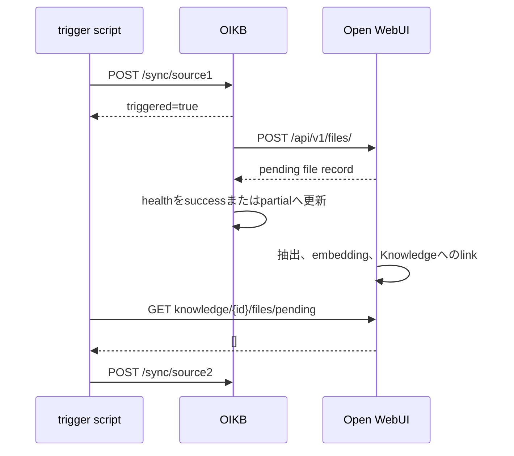

# OIKBとOpen WebUIの逐次同期API調査

## 結論

`source1`をtriggerしてOpen WebUIの処理完了を待ち、その後に`source2`をtriggerする処理は、現在の構成で実装できる。ただし、完了判定にはOIKBとOpen WebUIの両方を確認する必要がある。

- OIKBの`GET /health`で、対象sourceの今回の同期が終了したことを確認する。
- Open WebUIの`GET /api/v1/knowledge/{id}/files/pending`で、対象Knowledge Baseから`pending`と`processing`がなくなったことを確認する。
- Open WebUIの全file一覧を同期前後で比較して今回作成されたfile IDを特定し、各fileの`completed`とKnowledgeへのlinkを確認する。
- Open WebUIのKnowledge file総数も同期前後で比較し、未登録fileを補助的に検出する。
- 上記を満たした後に、次のsourceをtriggerする。

OIKB 0.4.0のtrigger responseにはrun IDやuploadしたfile IDの一覧が含まれず、Open WebUIのpending APIは`failed` fileを返さない。ただし、同じKnowledge Baseへ同時に別のuploadが行われない条件なら、Open WebUIの全file一覧の同期前後差分から今回のfile IDを特定し、file status APIで個別に追跡できる。別schedulerやwebhookを含む同時実行下で今回のrunとfileを厳密に関連付けるには、OIKB側のrun IDとfile IDを公開するAPI拡張が必要になる。

## 調査対象

このrepositoryの[OIKB Containerfile](../../20-owui/oikb/Containerfile)は`ghcr.io/open-webui/oikb:0.4.0`をbase imageとしている。[Open WebUI Compose定義](../../20-owui/docker-compose.yml)は`ghcr.io/open-webui/open-webui:0.11.1`を使用している。

公式tagと対応commitは次のとおりである。

| Component | Tag | Commit |
| --- | --- | --- |
| OIKB | `v0.4.0` | `f99d2e66e7c0a24e5fe336a0242d5b334f979af6` |
| Open WebUI | `v0.11.1` | `d3e8bf3405e848cfba377814d0aa7ba7290e414d` |

2026-09-01に稼働中のlocal APIもread-onlyで確認した。OIKBの`GET /health`はversion `0.4.0`を返し、Open WebUIのpending APIとfile status APIはBearer認証付きrequestへHTTP 200を返した。OIKBが`success`の状態でもRustFS側Knowledge Baseには`pending`が6件残っており、OIKBの成功とOpen WebUIの登録完了が別段階であることを実環境でも確認した。なお、OIKB v0.4.0のFastAPI `info.version`はsource上で`0.3.5`に固定されているため、version確認にはOpenAPIの`info.version`ではなく`GET /health`の`version`を使う必要がある。[OIKB daemon実装](https://github.com/open-webui/oikb/blob/f99d2e66e7c0a24e5fe336a0242d5b334f979af6/src/oikb/daemon.py#L40-L49)

## 現在の非同期処理境界

同期処理は次の二段階に分かれる。



OIKBのupload clientはOpen WebUIの`POST /api/v1/files/`を呼び出し、HTTP responseを受け取るとそのfileを成功として集計する。[OIKB client実装](https://github.com/open-webui/oikb/blob/f99d2e66e7c0a24e5fe336a0242d5b334f979af6/src/oikb/client.py#L66-L91) Open WebUI側はdefaultで`process_in_background=true`であり、file rowを`pending`として作成した直後にbackground taskを登録してresponseを返す。[Open WebUI upload実装](https://github.com/open-webui/open-webui/blob/d3e8bf3405e848cfba377814d0aa7ba7290e414d/backend/open_webui/routers/files.py#L271-L279) [Open WebUI background処理登録](https://github.com/open-webui/open-webui/blob/d3e8bf3405e848cfba377814d0aa7ba7290e414d/backend/open_webui/routers/files.py#L393-L448)

したがって、OIKBが`success`になった時点では、Open WebUIの抽出、embedding、Knowledge Baseへのlinkが続いている場合がある。Open WebUIは、通常のfile処理とKnowledge collectionへのvector書き込みを終えた後にKnowledgeへlinkする。[Open WebUI Knowledge自動link実装](https://github.com/open-webui/open-webui/blob/d3e8bf3405e848cfba377814d0aa7ba7290e414d/backend/open_webui/routers/files.py#L201-L248)

## OIKB API

### `POST /sync/{identifier}`

`identifier`にはsourceの`name`または`kb-id`を指定する。Bearer認証が設定されている場合は`Authorization: Bearer ...`が必要になる。通常実行では同期taskを作成して直ちに次のresponseを返す。[OIKB trigger endpoint](https://github.com/open-webui/oikb/blob/f99d2e66e7c0a24e5fe336a0242d5b334f979af6/src/oikb/daemon.py#L182-L197)

```json
{
  "triggered": true,
  "name": "source1",
  "kb_id": "knowledge-base-id"
}
```

次の制約がある。

- responseにはrun ID、開始時刻、upload予定file数、upload後のfile IDが含まれない。
- 未知のidentifierでもHTTP 404ではなく、`triggered: false`を含むHTTP 200 responseになる。
- 同じKnowledge Baseの同期が実行中の場合、per-KB lockにより新しいtaskはskipされるが、trigger endpoint自体はtaskを作成した時点で`triggered: true`を返す。[OIKB per-KB lock](https://github.com/open-webui/oikb/blob/f99d2e66e7c0a24e5fe336a0242d5b334f979af6/src/oikb/daemon.py#L242-L260)

### `GET /health`

認証なしで利用でき、`sources` objectにsourceごとの最新状態を返す。objectのkeyは設定上の`source`値であり、friendly nameは各valueの`name`に格納される。[OIKB health endpoint](https://github.com/open-webui/oikb/blob/f99d2e66e7c0a24e5fe336a0242d5b334f979af6/src/oikb/daemon.py#L142-L153)

実行中は次のfieldを持つ。

```json
{
  "name": "source1",
  "status": "running",
  "started_at": 1788264952.0
}
```

終了時は`status`が`success`、`partial`、`error`または`cancelled`になり、成功または一部成功では`last_sync`、`duration_ms`、`files_added`、`files_modified`、`files_deleted`、`warnings`、`errors`が返る。[OIKB state更新](https://github.com/open-webui/oikb/blob/f99d2e66e7c0a24e5fe336a0242d5b334f979af6/src/oikb/daemon.py#L263-L420)

以前の`success`を今回の終了と誤認しないよう、trigger直前の`last_sync`と時刻を保存し、次のいずれかを確認する必要がある。

- `status == "running"`かつ`started_at`がtrigger時刻以降になる。
- terminal statusになり、`last_sync`がtrigger前の値より新しくなる。

`partial`、`error`、`cancelled`では次のsourceへ進まず、その周期を失敗として終了するのが安全である。

### `GET /history`

Bearer認証付きで、`limit`、`kb_id`、`errors_only`によるfilterを受け付ける。entryには`id`、`source`、`kb_id`、`status`、`started_at`、`finished_at`、変更file数などが含まれる。[OIKB history endpoint](https://github.com/open-webui/oikb/blob/f99d2e66e7c0a24e5fe336a0242d5b334f979af6/src/oikb/daemon.py#L162-L179) [OIKB history schema](https://github.com/open-webui/oikb/blob/f99d2e66e7c0a24e5fe336a0242d5b334f979af6/src/oikb/history.py#L18-L37)

history entryは同期終了後に初めてinsertされ、trigger responseのIDとは関連付けられない。sourceとKnowledge Base IDの対応を調べる用途には使えるが、進行中runの監視には`GET /health`を使う必要がある。

## Open WebUI API

### `GET /api/v1/knowledge/{id}/files/pending`

Bearer認証付きで、Knowledge Baseへまだlinkされていないfileのうち、`data.status`が`pending`または`processing`のものを`FileModelResponse`のlistとして返す。`stream=true`では3秒ごとに状態を送信するServer-Sent Events streamになり、listが空になると終了する。[Open WebUI pending endpoint](https://github.com/open-webui/open-webui/blob/d3e8bf3405e848cfba377814d0aa7ba7290e414d/backend/open_webui/routers/knowledge.py#L1261-L1325)

通常responseの主要fieldは次のとおりである。[Open WebUI file response model](https://github.com/open-webui/open-webui/blob/d3e8bf3405e848cfba377814d0aa7ba7290e414d/backend/open_webui/models/files.py#L77-L89)

```json
[
  {
    "id": "file-id",
    "filename": "example.pdf",
    "data": {"status": "pending"},
    "meta": {},
    "created_at": 1788264952,
    "updated_at": 1788264952
  }
]
```

このAPIが空listになれば、対象Knowledge Baseに処理中fileがないことを判定できる。ただし、次の制約がある。

- `failed`はquery対象外なので、空listは全fileの成功を意味しない。[Open WebUI pending query](https://github.com/open-webui/open-webui/blob/d3e8bf3405e848cfba377814d0aa7ba7290e414d/backend/open_webui/models/files.py#L407-L440)
- DB queryでexceptionが発生した場合も実装が空listを返すため、HTTP 200の空listだけではquery成功と「対象なし」を区別できない。[Open WebUI pending query error処理](https://github.com/open-webui/open-webui/blob/d3e8bf3405e848cfba377814d0aa7ba7290e414d/backend/open_webui/models/files.py#L439-L443)

### `GET /api/v1/files/{id}/process/status`

file IDが分かっている場合は、`pending`、`processing`、`completed`、`failed`を個別に確認できる。`stream=true`では`completed`または`failed`までServer-Sent Eventsを返す。[Open WebUI file status endpoint](https://github.com/open-webui/open-webui/blob/d3e8bf3405e848cfba377814d0aa7ba7290e414d/backend/open_webui/routers/files.py#L611-L662)

このendpointが最も明確なper-file完了判定になる。OIKB 0.4.0はupload responseから得たfile IDをhealth、history、trigger responseのいずれにも公開しないが、次節の全file一覧を同期前後で比較すれば、同時uploadがない条件で今回のfile IDを推定できる。

`completed`への更新はvector保存後に行われ、その後にKnowledgeへのlinkが行われるため、短い時間だが`completed`で未linkの状態が存在し得る。[Open WebUI vector保存完了処理](https://github.com/open-webui/open-webui/blob/d3e8bf3405e848cfba377814d0aa7ba7290e414d/backend/open_webui/routers/retrieval.py#L1994-L2080) file statusだけでなく、Knowledge file一覧への出現も確認する必要がある。

### `GET /api/v1/files/`

Bearer認証付きで、認証userが参照できるfileを1page 50件の`items`と`total`で返す。`content=false`を指定すれば本文を除外できる。[Open WebUI file list endpoint](https://github.com/open-webui/open-webui/blob/d3e8bf3405e848cfba377814d0aa7ba7290e414d/backend/open_webui/routers/files.py#L468-L493)

全pageを取得し、各itemの`meta.data.knowledge_id`で対象Knowledge Baseを絞る。trigger前のID setとOIKB終了後のID setの差分は、他のuploadが同時に行われていなければ今回作成されたfile IDになる。OIKB終了時の`files_added + files_modified`と差分件数も照合できる。

### `GET /api/v1/knowledge/{id}/files`

Knowledge Baseへlink済みのfileを返し、responseには`items`と`total`が含まれる。[Open WebUI Knowledge file endpoint](https://github.com/open-webui/open-webui/blob/d3e8bf3405e848cfba377814d0aa7ba7290e414d/backend/open_webui/routers/knowledge.py#L1328-L1394) [Open WebUI Knowledge file response](https://github.com/open-webui/open-webui/blob/d3e8bf3405e848cfba377814d0aa7ba7290e414d/backend/open_webui/models/knowledge.py#L180-L184)

同期前の`total`を`N`、OIKB終了後の`files_added`を`A`、`files_deleted`を`D`とすると、同時に別の更新がない条件では期待値は`N + A - D`になる。modified fileは旧fileの削除と新fileの追加が対になるため、総数への影響は0である。この比較により、pendingから消えたもののKnowledgeへlinkされなかったbackground failureを検出できる。

## 推奨する逐次処理

各周期で、明示されたsource順に次の処理を行う。

1. OIKBのhealthとhistoryからsource name、source key、Knowledge Base IDの対応を解決する。
2. 対象sourceが`running`でないことを確認する。
3. Open WebUIのpending listが空であることを確認する。全file一覧から対象Knowledge Baseのfile ID setを作り、Knowledge fileのlink済みID setと`total`も保存する。
4. OIKB healthの`last_sync`と現在時刻を保存する。
5. `POST /sync/{source-name}`を送り、responseの`triggered`、`name`、`kb_id`を検証する。
6. OIKB healthで今回のrun開始または新しい`last_sync`を確認し、terminal statusまでpollする。
7. `success`以外なら、その周期を失敗として終了する。
8. Open WebUIの全file一覧を再取得し、同期前との差分件数がOIKBの`files_added + files_modified`になるまで待つ。
9. 差分の各file IDについてfile statusをpollし、すべて`completed`になることを確認する。`failed`なら直ちに失敗とする。
10. 差分の全file IDがKnowledge file一覧へlinkされ、pending listが空になることを確認する。
11. Knowledge fileの`total`が`同期前total + files_added - files_deleted`になることを確認する。
12. 条件を満たした場合だけ次のsourceへ進む。

poll intervalとOIKB待機timeout、Open WebUI待機timeoutは個別に設定できるようにする。timeout、`partial`、`error`、`cancelled`、期待file数不一致では後続sourceをtriggerしない。OIKBの`warnings`はlogへ残す。

source順はOIKB APIの正式なresponse contractに含まれないため、script optionまたは環境変数で明示するのが安全である。現在のscriptがsource nameをalphabetical orderへsortする動作だけでは、利用者が意図する`source1`、`source2`の順序を表現できない。

## 実現可能性と制約

| 要件 | 判定 | 理由 |
| --- | --- | --- |
| sourceごとにOIKB同期終了を待つ | 実現可能 | healthの`running`と新しい`last_sync`を監視できる。 |
| Open WebUIの処理中fileがなくなるまで待つ | 実現可能 | Knowledge pending APIをpollできる。 |
| background failureを検出する | 条件付きで実現可能 | 全file一覧の差分、file status、Knowledge link、総数を併用できるが、同時更新があると判定が曖昧になる。 |
| 今回uploadした全fileをID単位で追跡する | 条件付きで実現可能 | 同時uploadがなければ全file一覧の同期前後差分を使える。厳密なrun相関にはOIKBのAPI拡張が必要になる。 |
| trigger scriptが開始したsourceを逐次化する | 実現可能 | 後続triggerを完了条件まで保留できる。 |
| OIKB daemon内蔵schedulerを含む全実行を常に逐次化する | APIだけでは不可 | daemonはsourceごとに独立taskを作成し、scheduler起動時から並行実行する。[OIKB scheduler実装](https://github.com/open-webui/oikb/blob/f99d2e66e7c0a24e5fe336a0242d5b334f979af6/src/oikb/daemon.py#L426-L478) |

今回の変更対象を外部trigger scriptが開始する1時間周期の処理に限定すれば、推奨手順で実装できる。OIKB daemonの6時間schedulerやstartup時の初回同期も含めて厳密に逐次化する場合は、daemonのscheduler無効化optionまたはserial schedulerをOIKBへ追加する必要がある。

## References

- [open-webui/oikb v0.4.0](https://github.com/open-webui/oikb/tree/f99d2e66e7c0a24e5fe336a0242d5b334f979af6)
- [OIKB daemon API implementation](https://github.com/open-webui/oikb/blob/f99d2e66e7c0a24e5fe336a0242d5b334f979af6/src/oikb/daemon.py)
- [OIKB Open WebUI client implementation](https://github.com/open-webui/oikb/blob/f99d2e66e7c0a24e5fe336a0242d5b334f979af6/src/oikb/client.py)
- [OIKB sync implementation](https://github.com/open-webui/oikb/blob/f99d2e66e7c0a24e5fe336a0242d5b334f979af6/src/oikb/sync.py)
- [OIKB history implementation](https://github.com/open-webui/oikb/blob/f99d2e66e7c0a24e5fe336a0242d5b334f979af6/src/oikb/history.py)
- [open-webui/open-webui v0.11.1](https://github.com/open-webui/open-webui/tree/d3e8bf3405e848cfba377814d0aa7ba7290e414d)
- [Open WebUI file router](https://github.com/open-webui/open-webui/blob/d3e8bf3405e848cfba377814d0aa7ba7290e414d/backend/open_webui/routers/files.py)
- [Open WebUI Knowledge router](https://github.com/open-webui/open-webui/blob/d3e8bf3405e848cfba377814d0aa7ba7290e414d/backend/open_webui/routers/knowledge.py)
- [Open WebUI retrieval router](https://github.com/open-webui/open-webui/blob/d3e8bf3405e848cfba377814d0aa7ba7290e414d/backend/open_webui/routers/retrieval.py)
- [Open WebUI file model](https://github.com/open-webui/open-webui/blob/d3e8bf3405e848cfba377814d0aa7ba7290e414d/backend/open_webui/models/files.py)
- [Open WebUI Knowledge model](https://github.com/open-webui/open-webui/blob/d3e8bf3405e848cfba377814d0aa7ba7290e414d/backend/open_webui/models/knowledge.py)
